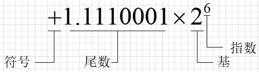

## 1.浮点数在计算机内的存储

根据IEEE标准，浮点数是通过科学计数法来存储的，比如120.5用十进制的科学计数法来表示就是1.205\*10^2，但是计算机中所有数据都是用二进制存储的，所以得先转换为二进制数，即1.1110001\*2^6。



浮点数在计算机中的存储分为三个部分：
　　 1. 符号位（sign）：float和double符号位均为1位，0代表正数，1代表负数
　　 2. 指数位（exponent）：存储科学计数法中的指数部分，采用移位存储
　　 3. 尾数位（fraction）：存储科学计数法中的尾数部分


根据[IEEE 754](https://zh.wikipedia.org/wiki/IEEE_754#32位單精度)标准，单精度float类型使用32比特存储，其中1位表示符号，8位表示指数，23位表示尾数；双精度double类型使用64比特存储，1位符号位，11位指数位，52位尾数位。

因此受限于各部分有效数值长度限制，浮点数是有精度限制的。


## 2.浮点数的精度疑问

```c++
    {
        float f1 = 5000.2f;
        float f2 = 5000.5f;
        printf("原数值 float f1=5000.2f float f2=5000.5f\n");
        printf("3位精度 f1=%.3f f2=%.3f\n", f1, f2);
        printf("6位精度 f1=%.6f f2=%.6f\n", f1, f2);
        printf("12位精度 f1=%.12f f2=%.12f\n", f1, f2);
        printf("24位精度 f1=%.24f f2=%.24f\n", f1, f2);
    }
    {
        float f1 = 0.2f;
        float f2 = 0.5f;
        printf("原数值 float f1=0.2f float f2=0.5f\n");
        printf("3位精度 f1=%.3f f2=%.3f\n", f1, f2);
        printf("6位精度 f1=%.6f f2=%.6f\n", f1, f2);
        printf("12位精度 f1=%.12f f2=%.12f\n", f1, f2);
        printf("24位精度 f1=%.24f f2=%.24f\n", f1, f2);
    }

    /*
    输出结果：
    原数值 float f1=5000.2f float f2=5000.5f
    3位精度 f1=5000.200 f2=5000.500
    6位精度 f1=5000.200195 f2=5000.500000
    12位精度 f1=5000.200195312500 f2=5000.500000000000
    24位精度 f1=5000.200195312500000000000000 f2=5000.500000000000000000000000
    
    原数值 float f1=0.2f float f2=0.5f
    3位精度 f1=0.200 f2=0.500
    6位精度 f1=0.200000 f2=0.500000
    12位精度 f1=0.200000002980 f2=0.500000000000
    24位精度 f1=0.200000002980232238769531 f2=0.500000000000000000000000
    */
```

如上代码为什么5000.2和5000.5从数值上看精度范围是一样的，但是输出后5000.2精度失真，而5000.5精度准确？

主要原因要参见前面的科学计数法表示方式是**<u>二进制</u>**的，所以我们判断精度不能以10进制的精度来简单判定。

这个精度不一致主要出现在0.2和0.5上，首先，我们了解一下**十进制小数转换为二进制小数**：

十进制小数转换成二进制小数采用"**乘2取整，顺序排列"**法。具体做法是：用2乘十进制小数，可以得到积，将积的整数部分取出，再用2乘余下的小数 部分，又得到一个积，再将积的整数部分取出，如此进行，直到积中的小数部分为零，或者达到所要求的精度为止。

然后把取出的整数部分按顺序排列起来，先取的整数作为二进制小数的高位有效位，后取的整数作为低位有效位。

例如把（0.8125）转换为二进制小数。

解：


所以0.5转换成二进制小数即为0.1，而0.2转换成二进制小数是0.0011001100110011...，所以长度超出了精度允许范围，所以5000.2和5000.5看起来"精度一致"，实际上精度差距很大，这也就是上面结果出现的原因。