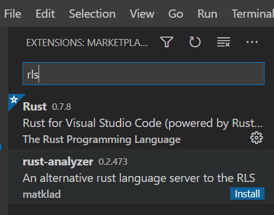
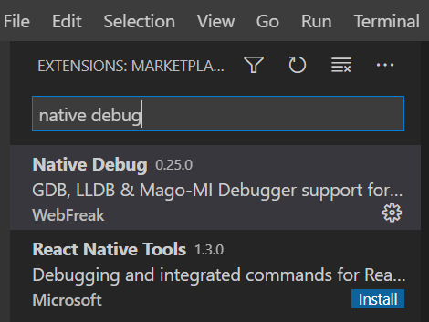

# 安装及配置

```bash
# 配置国内镜像地址
# Linux下添加环境变量命令
export RUSTUP_DIST_SERVER=https://mirrors.ustc.edu.cn/rust-static
export RUSTUP_UPDATE_ROOT=https://mirrors.ustc.edu.cn/rust-static/rustup
# Windows下自行添加

# Linux下执行安装命令
curl https://sh.rustup.rs -sSf | sh
# Windows下在https://www.rust-lang.org/tools/install下载安装包

# 安装完成后配置crates国内镜像
[source.crates-io]
registry = "https://github.com/rust-lang/crates.io-index"
replace-with = 'ustc'
# 中科大镜像
[source.ustc]
registry = "git://mirrors.ustc.edu.cn/crates.io-index"
# 清华大学镜像
[source.tuna]
registry = "https://mirrors.tuna.tsinghua.edu.cn/git/crates.io-index.git"
# 如果遇到ssh-agent失败问题
# 具体问题见 https://github.com/rust-lang/cargo/issues/2078
[net]
git-fetch-with-cli = true
```

# VS Code插件及配置

### 插件：





### 配置：

**tasks.json文件**

```json
{ 
    "version": "2.0.0", 
    "tasks": [ 
        { 
            "label": "build", 
            "type": "shell", 
            "command":"cargo", 
            "args": ["build"] 
        } 
    ] 
}
```

**launch.json文件**

注：高版本中不再使用externalConsole配置而是使用console配置，注意根据需要进行调整

**Windows版本：**

```json
{ 
    "version": "0.2.0", 
    "configurations": [ 
        { 
            "name": "(Windows) 启动", 
            "preLaunchTask": "build", 
            "type": "cppvsdbg", 
            "request": "launch", 
            "program": "${workspaceFolder}/target/debug/${workspaceFolderBasename}.exe", 
            "args": [], 
            "stopAtEntry": false, 
            "cwd": "${workspaceFolder}", 
            "environment": [], 
            "externalConsole": false 
        }, 
        { 
            "name": "(gdb) 启动", 
            "type": "cppdbg", 
            "request": "launch", 
            "program": "${workspaceFolder}/target/debug/${workspaceFolderBasename}.exe", 
            "args": [], 
            "stopAtEntry": false, 
            "cwd": "${workspaceFolder}", 
            "environment": [], 
            "externalConsole": false, 
            "MIMode": "gdb", 
            "miDebuggerPath": "这里填GDB所在的目录", 
            "setupCommands": [ 
                { 
                    "description": "为 gdb 启用整齐打印", 
                    "text": "-enable-pretty-printing", 
                    "ignoreFailures": true 
                } 
            ] 
        } 
    ] 
}
```

**Linux版本：**

```json
{
    "version": "0.2.0",
    "configurations": [
        {
            "name": "Debug",
            "type": "gdb",
            "preLaunchTask": "build",
            "request": "launch",
            "target": "${workspaceFolder}/target/debug/${workspaceFolderBasename}",
            "cwd": "${workspaceFolder}"
        }
    ]
}
```

**Mac OS版本：**

```json
{
    "version": "0.2.0",
    "configurations": [
        {
            "name": "(lldb) 启动",
            "type": "cppdbg",
            "preLaunchTask": "build",
            "request": "launch",
            "program": "${workspaceFolder}/target/debug/${workspaceFolderBasename}",
            "args": [],
            "stopAtEntry": false,
            "cwd": "${workspaceFolder}",
            "environment": [],
            "externalConsole": false,
            "MIMode": "lldb"
        }
    ]
}
```

